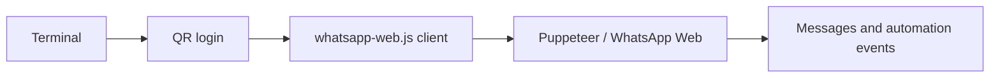

# WhatsApp Web Automation Bot

<div align="center">


A small WhatsApp Web automation experiment built with `whatsapp-web.js` and Puppeteer.

</div>



## Setup

```bash
npm install
node main.js
```

Scan the QR code printed in the terminal with WhatsApp's linked-devices flow. Keep the terminal session running while the bot is active.

## Dependencies

- `whatsapp-web.js` for the WhatsApp Web client.
- `puppeteer` for browser automation.
- `qrcode-terminal` for local QR rendering.
- `lodash` for utility helpers.

## Important

This is an unofficial automation experiment. Automated account behavior may violate platform rules or lead to account restrictions. Do not use it for spam, unsolicited messages, or sensitive workflows, and never commit session credentials.
